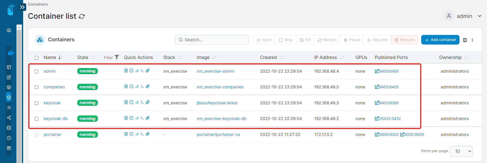

# XM Golang Exercise - v22.0.0

## Technical requirements

Build a microservice to handle companies. It should provide the following operations:

- Create 
- Patch
- Delete
- Get (one)

Each company is defined by the following attributes:
- ID (uuid) required
- Name (15 characters) required - unique
- Description (3000 characters) optional
- Amount of Employees (int) required
- Registered (boolean) required
- Type (Corporations | NonProfit | Cooperative | Sole Proprietorship) required

Only authenticated users should have access to create, update and delete companies.

## Realization

Microservices were made with:
- Golang v1.19
- GORM
- Gin
- Zap logger
- REST API

Database:
- PostgreSQL v15

Authorization and authentication (via JWT-token):
- Keycloak

Deploy all components was made with `docker-compose` file.

## Installation instructions

## Working process

### Start:
```
docker-compose -p "xm_exercise" up -d
```

### Stop:
```
docker-compose -p "xm_exercise" down
```

## Work with keycloak

Admin panel:
http://localhost:8403/auth/

```
KEYCLOAK_USER: admin
KEYCLOAK_PASSWORD: admin
```

## Getting client secret

Client: admin

URL: http://localhost:8400/

Your client need to have the access-type set to `confidential` , then you will have a new tab credentials where you will see the `client secret`.

See https://wjw465150.gitbooks.io/keycloak-documentation/content/server_admin/topics/clients/oidc/confidential.html

Client secret is needed to put in parameter

```keycloak->client_secret:```

in files
- .\admin\admin.yml
- .\companies\companies.yml

## System Scheme


## Tests

File of Postman collection see in `.\doc\xm_exercise.postman_collection.json`

### Step 1 - healthcheck

Admin:
```
GET http://localhost:8400/v1.0.0/ping
```

Companies:
```
GET http://localhost:8405/v1.0.0/ping
```

### Step 2 - get Company by ID (any users)

```
GET http://localhost:8405/v1.0.0/companies/e1da4d2a-520d-11ed-977a-0242ac130002
```
Result: 200 OK
```json
{
    "id": "e1da4d2a-520d-11ed-977a-0242ac130002",
    "name": "Company 1",
    "description": "The First Company",
    "amount": 10,
    "registered": "false",
    "type": "NonProfit",
    "created_at": "2022-10-22T13:31:49.550064Z"
}
```

### Step 3 - get JWT for actions

Get JWT-token by login and password
```
POST http://localhost:8400/v1.0.0/api/login
```
Body
```json
{
    "username":  "manager",
    "password":  "manager"
}
```

Result: 200 OK

```json
{
    "status": "ok",
    "type": "account",
    "currentAuthority": [
        "companies",
        "default-roles-master",
        "offline_access",
        "uma_authorization"
    ],
    "tokenA": "eyJhbGciOiJSUzI1NiIsInR5cCIgOiAiSldUIiwia2lkIiA6ICItVUtCQ1hlLVd6VE84OUk3MFlvZHN3ZnRmcFhhcmRaNG5qOERoUVUyY1Q0In0.eyJleHAiOjE2NjY0NjcxMjUsImlhdCI6MTY2NjQ2NzA2NSwianRpIjoiOTUzNjY4NTQtOGI0Mi00ZjM0LWI4ZjEtODAwNWJkZjkxYjgwIiwiaXNzIjoiaHR0cDovL2hvc3QuZG9ja2VyLmludGVybmFsOjg0MDMvYXV0aC9yZWFsbXMvbWFzdGVyIiwiYXVkIjoiYWNjb3VudCIsInN1YiI6IjcyZGE3ZjhhLTk0NzgtNDZjMy04YjAwLTMzNTdhYWVjZTM2YSIsInR5cCI6IkJlYXJlciIsImF6cCI6ImFkbWluIiwic2Vzc2lvbl9zdGF0ZSI6Ijk1YjRkM2MyLTdmMmMtNGU4My1iYzQ4LWY3NjE4MDAwZTY1MiIsImFjciI6IjEiLCJyZWFsbV9hY2Nlc3MiOnsicm9sZXMiOlsiY29tcGFuaWVzIiwiZGVmYXVsdC1yb2xlcy1tYXN0ZXIiLCJvZmZsaW5lX2FjY2VzcyIsInVtYV9hdXRob3JpemF0aW9uIl19LCJyZXNvdXJjZV9hY2Nlc3MiOnsiYWNjb3VudCI6eyJyb2xlcyI6WyJtYW5hZ2UtYWNjb3VudCIsIm1hbmFnZS1hY2NvdW50LWxpbmtzIiwidmlldy1wcm9maWxlIl19fSwic2NvcGUiOiJlbWFpbCBwcm9maWxlIiwic2lkIjoiOTViNGQzYzItN2YyYy00ZTgzLWJjNDgtZjc2MTgwMDBlNjUyIiwiZW1haWxfdmVyaWZpZWQiOmZhbHNlLCJwcmVmZXJyZWRfdXNlcm5hbWUiOiJtYW5hZ2VyIn0.faDP3U6-5NoshLYDwfqGfkXL0RcC6TEc87zyJsNnrC09Ju9P-QnWKSTzQzKVYsciJqf8ByETObFbHX8I9Gs8-goTZkb3PRUVve9aFsrAyy_7Ya_--5ZWBAYi-JgSqu-P280o_L0PV4sgFjmy5aUShwRTBT9EuhfrDRfGC1likV33PXX1BA7cHVY2J9b1Hw_1YVS0zBMqOajM-x0qE-o9JkkwRaug3x0M3E9nmwp1COBrt8WUuhDs93I3GygtPpttOwOiLTysQCt3yCc8NWSWVLZ-QVw3-K80pI7WtipukEthxQOGfsUlMZOujJZLBqyJf8adtbB9daLFeWgZNz8Uzg",
    "tokenR": "eyJhbGciOiJIUzI1NiIsInR5cCIgOiAiSldUIiwia2lkIiA6ICIxN2UwZGJlNi04ZDc3LTRkZTUtOWE3ZS1jZjgxMDI4NTg4NmIifQ.eyJleHAiOjE2NjY0Njg4NjUsImlhdCI6MTY2NjQ2NzA2NSwianRpIjoiODEyNjJlODAtZmE4Ny00ZTUyLWI3NzUtOWU0YmY1NGFmMDQ5IiwiaXNzIjoiaHR0cDovL2hvc3QuZG9ja2VyLmludGVybmFsOjg0MDMvYXV0aC9yZWFsbXMvbWFzdGVyIiwiYXVkIjoiaHR0cDovL2hvc3QuZG9ja2VyLmludGVybmFsOjg0MDMvYXV0aC9yZWFsbXMvbWFzdGVyIiwic3ViIjoiNzJkYTdmOGEtOTQ3OC00NmMzLThiMDAtMzM1N2FhZWNlMzZhIiwidHlwIjoiUmVmcmVzaCIsImF6cCI6ImFkbWluIiwic2Vzc2lvbl9zdGF0ZSI6Ijk1YjRkM2MyLTdmMmMtNGU4My1iYzQ4LWY3NjE4MDAwZTY1MiIsInNjb3BlIjoiZW1haWwgcHJvZmlsZSIsInNpZCI6Ijk1YjRkM2MyLTdmMmMtNGU4My1iYzQ4LWY3NjE4MDAwZTY1MiJ9.7UjJ-G6TH4uFDkj7_V7z3vX8Vm1tYPUTEPN0etgk6Zg"
}
```

We need value at field

`"tokenA": eyJhbGciO...daLFeWgZNz8Uzg`

### Step 4 - Create new company (only authenticated users)

```
POST http://localhost:8400/v1.0.0/api/login
```
Header
```
Authorization = <value> at "tokenA"
```

Body
```json
{
  "name": "Company 2",
  "description": "The Second Company",
  "amount": 100,
  "registered": "false",
  "type": "NonProfit"
}
```
Result: 200 OK

```json
{
    "id": "4371e5b8-5216-11ed-8b90-0242ac130002",
    "name": "Company 2",
    "description": "The Second Company",
    "amount": 100,
    "registered": "false",
    "type": "NonProfit",
    "created_at": "2022-10-22T17:31:49.2538356+03:00"
}
```

### Step 5 - Update company (only authenticated users)

```
PATCH http://localhost:8405/v1.0.0/companies/
```
Header
```
Authorization = <value> at "tokenA"
```

Body
```json
{
  "id": "4371e5b8-5216-11ed-8b90-0242ac130002",
  "amount": 5000,
  "registered": "true",
  "type": "Corporations"
}
```
Result: 200 OK

```json
{
    "id": "4371e5b8-5216-11ed-8b90-0242ac130002",
    "amount": 5000,
    "registered": "true",
    "type": "Corporations"
}
```

### Step 6 - Delete the company (only authenticated users)

```
DELETE http://localhost:8405/v1.0.0/companies/49f62c46-5211-11ed-a802-0242ac130002
```
Header
```
Authorization = <value> at "tokenA"
```

Result: 200 OK

```json
{
  "message": "Record 49f62c46-5211-11ed-a802-0242ac130002 has been deleted",
  "status": 200
}
```

### Step 7 - Refresh auth tokens (only authenticated users)

```
POST http://localhost:8400/v1.0.0/api/refresh
```
Header
```
Authorization = <value> at "tokenR"
```

Result: 200 OK

```json
{
    "status": "ok",
    "type": "refresh",
    "currentAuthority": null,
    "tokenA": "eyJhbGciOiJSUzI1NiIsInR5cCIgOiAiSldUIiwia2lkIiA6ICItVUtCQ1hlLVd6VE84OUk3MFlvZHN3ZnRmcFhhcmRaNG5qOERoUVUyY1Q0In0.eyJleHAiOjE2NjY1MDU3MDksImlhdCI6MTY2NjUwNTY0OSwianRpIjoiMDVmMWZhODgtMTcwOC00MGE2LWFlY2YtZDkxMmE3NzIyODBlIiwiaXNzIjoiaHR0cDovL2hvc3QuZG9ja2VyLmludGVybmFsOjg0MDMvYXV0aC9yZWFsbXMvbWFzdGVyIiwiYXVkIjoiYWNjb3VudCIsInN1YiI6IjcyZGE3ZjhhLTk0NzgtNDZjMy04YjAwLTMzNTdhYWVjZTM2YSIsInR5cCI6IkJlYXJlciIsImF6cCI6ImFkbWluIiwic2Vzc2lvbl9zdGF0ZSI6IjNjMjMxZTBmLWYyMjUtNGM0Ny05NzAxLWZmNmIzZGM2ZTNlZCIsImFjciI6IjEiLCJyZWFsbV9hY2Nlc3MiOnsicm9sZXMiOlsiY29tcGFuaWVzIiwiZGVmYXVsdC1yb2xlcy1tYXN0ZXIiLCJvZmZsaW5lX2FjY2VzcyIsInVtYV9hdXRob3JpemF0aW9uIl19LCJyZXNvdXJjZV9hY2Nlc3MiOnsiYWNjb3VudCI6eyJyb2xlcyI6WyJtYW5hZ2UtYWNjb3VudCIsIm1hbmFnZS1hY2NvdW50LWxpbmtzIiwidmlldy1wcm9maWxlIl19fSwic2NvcGUiOiJlbWFpbCBwcm9maWxlIiwic2lkIjoiM2MyMzFlMGYtZjIyNS00YzQ3LTk3MDEtZmY2YjNkYzZlM2VkIiwiZW1haWxfdmVyaWZpZWQiOmZhbHNlLCJwcmVmZXJyZWRfdXNlcm5hbWUiOiJtYW5hZ2VyIn0.G2qZch6q29YR-RBdppGT0ZkcP6byLoQIiiWwxalVnDSgYcPYRm_dFCJOIhqGcU0NYDDYbPhGVk7wQYUiuW76W2zsTrHexDNVo_uULufY08MUbIYmFWwG_8dHGJUxg7epxr_3uDYPm4H_vjV1PZ6hGXuYQq6iWbLDUn265Gr3traxvOGFEwTpYP0hD3CByUQ694_iQ6gZN6qclod6_6V9Sjv_7XddUZ6Fh1-ZpNJpUO-ren-m0HotuXNWP72uIoFyRONKbgHiJu13XDhc_L2EsJ9tZ0wgF4fDoIs0H-x436rkjdRfxS22yP5tv93MX3bWcHFr98wvFaRX91jb2rDhTA",
    "tokenR": "eyJhbGciOiJIUzI1NiIsInR5cCIgOiAiSldUIiwia2lkIiA6ICIxN2UwZGJlNi04ZDc3LTRkZTUtOWE3ZS1jZjgxMDI4NTg4NmIifQ.eyJleHAiOjE2NjY1MDc0NDksImlhdCI6MTY2NjUwNTY0OSwianRpIjoiMmNmNjY4ZWUtMjIwNS00NTQ3LTgwNGQtZjdhZGU5OTdjYTY5IiwiaXNzIjoiaHR0cDovL2hvc3QuZG9ja2VyLmludGVybmFsOjg0MDMvYXV0aC9yZWFsbXMvbWFzdGVyIiwiYXVkIjoiaHR0cDovL2hvc3QuZG9ja2VyLmludGVybmFsOjg0MDMvYXV0aC9yZWFsbXMvbWFzdGVyIiwic3ViIjoiNzJkYTdmOGEtOTQ3OC00NmMzLThiMDAtMzM1N2FhZWNlMzZhIiwidHlwIjoiUmVmcmVzaCIsImF6cCI6ImFkbWluIiwic2Vzc2lvbl9zdGF0ZSI6IjNjMjMxZTBmLWYyMjUtNGM0Ny05NzAxLWZmNmIzZGM2ZTNlZCIsInNjb3BlIjoiZW1haWwgcHJvZmlsZSIsInNpZCI6IjNjMjMxZTBmLWYyMjUtNGM0Ny05NzAxLWZmNmIzZGM2ZTNlZCJ9.0oNNdRf34HitXgA2JDX63iNCa2N7_kWlo4bFokvNXsc"
}
```

## Manage containers

See logs and parameters of each microservice we could via [Portainer](http://localhost:9000/#!/home):



## Swagger API-documentation

Admin:
```
.\admin\doc\swagger.json
```

Companies:
```
.\companies\doc\swagger.json
```